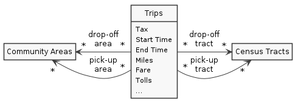

# Row Level Security Tutorial

## Introduction

This tutorial demonstrates row-level security based on a concrete example. We are going to use a [taxi trips dataset](https://data.cityofchicago.org/Transportation/Taxi-Trips/wrvz-psew) kindly provided for public use by the city of Chicago.

### What you Will Learn

Working through this tutorial you will learn the following things:

1. Import a publicly available dataset into Exasol
1. Create a view that establishes row-ownership based on business data
1. Create an RLS Virtual Schema
1. Access restrictions with row-level security

### Target Audience

This tutorial is targeted at database users and administrators wanting to learn more about Exasol's row-level security.

We assume our readers have a firm knowledge of database principles in general and the SQL language in particular. Also readers should be able to set up an Exasol database or at least have administrator access to an existing one with internet access and configured name servers.

### Terms and Abbreviations

BACP
: Department of Business Affairs & Consumer Protection</dd>

Dimension table
: Table type in an analytical database that holds descriptions for objects of the business case like for example a product description in a sales database.

Fact table
: Table type in an analytical database that holds business process data like the individual sales in a sales database. Fact tables hold references to keys in dimension tables and concrete values.</dd>

RLS
: See "Row Level Security"

Row Level Security
: Data access restrictions in a database on the level of an individual dataset (aka. "row").

### About the Dataset

We are using a dataset provided to the public by the City of Chicago. This dataset contains a [collection of taxi trips](https://digital.cityofchicago.org/index.php/chicago-taxi-data-released/). The collection started in 2013 and still keeps going. So the dataset grows all the time.



The dataset consists of one large fact table containing the actual taxi rides with details like start and end time, pickup and drop-off area.

Additionally, two dimension tables provide more information about the community areas where trips start and end as well as the [census tracts](https://en.wikipedia.org/wiki/Census_tract#United_States).

### Data Privacy and Masking

For privacy reasons the datasets use masking techniques that prevent tracking the passengers, so don't expect exact times or start and end addresses. Still, for our purposes the dataset provides lots of real-life content and is large enough to test the performance of RLS properly.

### The RLS Scenario

For the sake of the tutorial we are imagining that we are the Department of Business Affairs & Consumer Protection (BACP). We are collecting the data and are allowed to see every dataset. The taxi companies on the other hand, are only allowed to see the datasets that they themselves provide. This is a archetypal row-level security scenario.

Quite possibly that might be the deal the City of Chicago has with the taxi companies when it comes to handling the raw data &mdash; i.e. the data before [masking](#data-privacy-and-masking) is applied.

### Requirements and Assumptions

At the beginning of each IT project you should make a list of requirements, assumptions and constraints. Make sure you know which is which.

Requirements:

1. You (in your example the BACP) want to see all datasets
1. Each taxi company sees its own dataset

Constraints:

1. RLS runs on the same Exasol instance or cluster that it protects

Assumptions:

1. Each dataset is written once
1. Datasets are never modified
1. The same dataset will be read a lot of times
1. Reading speed is far more important than writing speed

Over the course of your IT project you will want to verify your assumptions. For the sake of this tutorial let's assume they are true.

### Actors

We can idendify three different actor types in our scenario:

1. Database administrator (`SYS`) user who creates the initial users and schemas
1. Department of Business Affairs & Consumer Protection (`BACP`)
1. Taxi companies

Each will be represented by a separate database user.

## RLS Design Considerations

Before you start to dive into setting up the database, let's first discuss a few design considerations.

### Staging Area and Production

Separating the import from production is the best practice for data ingestion, so we are going to have a stating area dedicated to importing the data from the servers of the City of Chicago. And a production area, where the actual work is done.

### The `EXA_ROW_TENANT` Column

We are going to implement [tenant-based security](introduction.md#tenant-based-security) in this tutorial and therefore need to add the column `EXA_ROW_TENANT` to the fact table (i.e. the taxi rides).

Now, the dataset already contains a column for the company, but that one does not have a strict format.

Here is are a few samples:

    0118 - 42111 Godfrey S.Awir
    0694 - 59280 Chinesco Trans Inc
    1085 - 72312 N and W Cab Co
    ...
    3141 - Zip Cab
    ...
    American United Cab Association
    ...

As you can see, the company names are not uniform. Also they contain spaces and special characters. If we want to use them to define tenancy, we need to unify them ourselves. And, since the values in the column `EXA_ROW_TENANT` are compared to user names, we need to turn them into proper identifiers.

### Options for Populating the `EXA_ROW_TENANT` Column

There are many ways to populate the `EXA_ROW_TENANT` column.

1. View on the staging table
1. View on the production table
1. Built directly into the merge from stage to production

Using views follows the Single-responsibility principle (SRP). The view is responsible for turning a business element into an identifier in the column `EXA_ROW_TENANT`. RLS takes care of protecting the data row by comparing the current user with the identifier in that column.

If you put the view on the production table, you can change the mapping without re-importing the data. On the other hand this comes at the expense of performance.

In our assumption list we earlier defined that reading speed is key, so we are definitely pre-calculating the column contents. That leaves us with the choice between the view on the staging area and building the mapping into the load from staging area to production.

For the sake of simplicity, we pick the last option.

## Structuring the Database

### Creating the Schemas

Staging area and production are organized in two separate schemas, which you create using the following commands as the database administrator.

```sql
CREATE SCHEMA CHICAGO_TAXI_STAGE;
CREATE SCHEMA CHICAGO_TAXI;
```

### Creating the Schema Owner User Account

In our example you are the BACP and you own the two schemas, so let's create that user now.

```sql
CREATE USER BACP IDENTIFIED BY "<password>";
```

Next you transfer ownership of the two schemas to `BACP`. With ownership `BACP` also automatically gets all privileges on the schemas.

```sql
ALTER SCHEMA CHICAGO_TAXI_STAGE CHANGE OWNER BACP;
ALTER SCHEMA CHICAGO_TAXI CHANGE OWNER BACP;
```

And finally you assign the global rights to log in, create tables and views as well as run imports to that user.

```sql
GRANT CREATE SESSION, CREATE TABLE, CREATE VIEW, IMPORT TO BACP;
```

Now log into Exasol as user `BACP` for the next steps.

### Creating a Staging Area

First, create the staging table for the taxi trips. This will hold the import from the large fact table.

```sql
CREATE OR REPLACE TABLE CHICAGO_TAXI_STAGE.TRIPS (
    TRIP_ID VARCHAR(40),
    TAXI_ID VARCHAR(255),
    TRIP_START_TIMESTAMP VARCHAR(24),
    TRIP_END_TIMESTAMP VARCHAR(24),
    TRIP_SECONDS DECIMAL(9),
    TRIP_MILES DECIMAL(18,4),
    PICKUP_CENSUS_TRACT VARCHAR(100),
    DROPOFF_CENSUS_TRACT VARCHAR(100),
    PICKUP_COMMUNITY_AREA DECIMAL,
    DROPOFF_COMMUNITY_AREA DECIMAL,
    FARE VARCHAR(100),
    TIPS VARCHAR(100),
    TOLLS VARCHAR(100),
    EXTRAS VARCHAR(100),
    TRIP_TOTAL VARCHAR(100),
    PAYMENT_TYPE VARCHAR(100),
    COMPANY VARCHAR(100),
    PICKUP_CENTROID_LATITUDE DECIMAL(18,9),
    PICKUP_CENTROID_LONGITUDE DECIMAL(18,9),
    PICKUP_CENTROID_LOCATION VARCHAR(100),
    DROPOFF_CENTROID_LATITUDE NUMERIC(18,9),
    DROPOFF_CENTROID_LONGITUDE NUMERIC(18,9),
    DROPOFF_CENTROID_LOCATION VARCHAR(100)
);
```

Unfortunately, we have to define the timestamps as `VARCHAR` for this particular table. The table is large and the only current way to limit the number of records during download is to use an API that produces a timestamp format that Exasol's importer up to 6.2.x does not recognize.

The following view gives us proper timestamps.

``` sql
CREATE OR REPLACE VIEW CHICAGO_TAXI_STAGE.V_TRIPS
AS SELECT
    TRIP_ID, TAXI_ID,
    TO_TIMESTAMP(REPLACE(TRIP_START_TIMESTAMP, 'T', ' ')) AS TRIP_START_TIMESTAMP,
    TO_TIMESTAMP(REPLACE(TRIP_END_TIMESTAMP, 'T', ' ')) AS TRIP_END_TIMESTAMP,
    TRIP_SECONDS, TRIP_MILES, PICKUP_CENSUS_TRACT, DROPOFF_CENSUS_TRACT,
    PICKUP_COMMUNITY_AREA, DROPOFF_COMMUNITY_AREA, FARE, TIPS, TOLLS, EXTRAS,
    TRIP_TOTAL, PAYMENT_TYPE, COMPANY,
    PICKUP_CENTROID_LATITUDE, PICKUP_CENTROID_LONGITUDE,
    PICKUP_CENTROID_LOCATION, DROPOFF_CENTROID_LATITUDE,
    DROPOFF_CENTROID_LONGITUDE, DROPOFF_CENTROID_LOCATION
FROM CHICAGO_TAXI_STAGE.TRIPS;
```

The two accompanying dimension tables are rather small, so we can later afford to use an API that does not support limiting the number of rows but gives us a recognized timestamp format directly. No view magic needed.

```sql
CREATE OR REPLACE TABLE CHICAGO_TAXI_STAGE.CENSUS_TRACTS(
    THE_GEOM VARCHAR(2000000),
    STATEFP10 DECIMAL(9),
    COUNTYFP10 DECIMAL(9),
    TRACTCE10 DECIMAL(9),
    GEOID10 DECIMAL(11),
    NAME10 DECIMAL(9),
    NAMELSAD10 VARCHAR(100),
    COMMAREA DECIMAL(9),
    COMMAREA_N DECIMAL(9),
    NOTES VARCHAR(1000)
);

CREATE OR REPLACE TABLE CHICAGO_TAXI_STAGE.COMMUNITY_AREAS(
    THE_GEOM VARCHAR(2000000),
    PERIMETER DECIMAL(9),
    AREA DECIMAL(9),
    COMAREA DECIMAL(9),
    COMAREA_ID DECIMAL(9),
    AREA_NUMBER DECIMAL(9),
    COMMUNITY VARCHAR(100),
    AREA_NUM_1 DECIMAL(9),
    SHAPE_AREA DOUBLE,
    SHAPE_LEN DOUBLE
);
```

### Creating a Production Area

First, you create the table with the taxi trips, using the `V_TRIPS` view from the staging area as a template and adding the `EXA_ROW_TENANT`.

```sql
CREATE OR REPLACE TABLE CHICAGO_TAXI.TRIPS
(LIKE CHICAGO_TAXI_STAGE.V_TRIPS, EXA_ROW_TENANT VARCHAR(128));
```

In case of the dimension tables you simply make a 1:1 copy.

```sql
CREATE OR REPLACE TABLE CHICAGO_TAXI.CENSUS_TRACTS
(LIKE CHICAGO_TAXI_STAGE.CENSUS_TRACTS);

CREATE OR REPLACE TABLE CHICAGO_TAXI.COMMUNITY_AREAS
(LIKE CHICAGO_TAXI_STAGE.COMMUNITY_AREAS);
```

## Importing the Data Into the Staging Area

Let's first import the two smaller tables for practice, this is quite fast.

```sql
IMPORT INTO CHICAGO_TAXI_STAGE.CENSUS_TRACTS
FROM CSV AT 'https://data.cityofchicago.org/api/views/74p9-q2aq'
FILE 'rows.csv?accessType=DOWNLOAD'
SKIP=1;

IMPORT INTO CHICAGO_TAXI_STAGE.COMMUNITY_AREAS
FROM CSV AT 'https://data.cityofchicago.org/api/views/igwz-8jzy' FILE 'rows.csv?accessType=DOWNLOAD'
SKIP=1;
```

Both commands tell the EXALoader to directly [import](https://docs.exasol.com/sql/import.htm) the data from a download URL in [CSV](https://tools.ietf.org/html/rfc4180) format.

The `SKIP=1` option removes the header fields from the dataset.

```sql
IMPORT INTO CHICAGO_TAXI_STAGE.TRIPS
FROM CSV AT 'https://data.cityofchicago.org/resource' FILE 'wrvz-psew.csv?$limit=1000000&$order=trip_start_timestamp'
SKIP=1;
```

As mentioned earlier we use a slightly different API here, one that allows us to limit the number of datasets to 1 million. This way the import does not take forever.

## Importing the Data Into Production

First copy the data of the dimension tables.

```sql
INSERT INTO CHICAGO_TAXI.CENSUS_TRACTS
SELECT * FROM CHICAGO_TAXI_STAGE.CENSUS_TRACTS;

INSERT INTO CHICAGO_TAXI.COMMUNITY_AREAS
SELECT * FROM CHICAGO_TAXI_STAGE.COMMUNITY_AREAS;
```

Use the following command to copy the trips data from the stage to production. Note how we additionally populate the extra column `EXA_ROW_TENANTS` with an ID.

```sql
INSERT INTO CHICAGO_TAXI.TRIPS
SELECT TR.*,
UPPER(
    REGEXP_REPLACE(
        REGEXP_REPLACE(
            REGEXP_REPLACE(TR.COMPANY, '^[-0-9 ]*'),
        '\W+', '_'
        ),
        '_*$', ''
    )
)
FROM CHICAGO_TAXI_STAGE.V_TRIPS TR;
```

Note that this time we are copying the data from a view.

The ID is an upper-case, underscore-connected version of the company name. Leading numbers and trailing underscores are removed.

Let's take a look at the IDs this creates.

```sql
SELECT DISTINCT(COMPANY), EXA_ROW_TENANT
FROM CHICAGO_TAXI.TRIPS
ORDER BY EXA_ROW_TENANT;
```

| COMPANY                           | EXA_ROW_TENANT                   |
|-----------------------------------|----------------------------------|
| Blue Ribbon Taxi Association Inc. | BLUE_RIBBON_TAXI_ASSOCIATION_INC |
| Chicago Elite Cab Corp.           | CHICAGO_ELITE_CAB_CORP           |
| Choice Taxi Association           | CHOICE_TAXI_ASSOCIATION          |
| Dispatch Taxi Affiliation         | DISPATCH_TAXI_AFFILIATION        |
| 5437 - Great American Cab Co      | GREAT_AMERICAN_CAB_CO            |
| 6743 - Luhak Corp                 | LUHAK_CORP                       |
| Northwest Management LLC          | NORTHWEST_MANAGEMENT_LLC         |
| 2767 - Sayed M Badri              | SAYED_M_BADRI                    |
| Taxi Affiliation Services         | TAXI_AFFILIATION_SERVICES        |
| Yellow Cab                        | LUHAK_CORP                       |

## Protecting the Data with RLS

### Creating the RLS Virtual Schema

Exasol's row-level security implementation is a [Virtual Schema](https://github.com/exasol/virtual-schemas). If you know how views work, then consider Virtual Schemas a closely related concept.

A Virtual Schema is a projection of an underlying concrete schema. In the case of RLS, it adds a filter layer that makes sure that users only see what they are supposed to.

Please refer to the [user guide](administration.md#creating-the-virtual-schema) for detailed instructions on how to install the RLS package.

Execute the following SQL statements as user `SYS`.

```sql
CREATE SCHEMA RLS_VSADAPTER_SCHEMA;

CREATE OR REPLACE JAVA ADAPTER SCRIPT RLS_VSADAPTER_SCHEMA.RLS_VSADAPTER AS
    %scriptclass com.exasol.adapter.RequestDispatcher;
    %jar /buckets/bfsdefault/jars/row-level-security-dist-3.0.6.jar;
/
;


CREATE CONNECTION EXASOL_JDBC_CONNECTION
TO 'jdbc:exa:localhost:8563'
USER 'BACP'
IDENTIFIED BY '<password>';

CREATE VIRTUAL SCHEMA RLS_CHICAGO_TAXI_VS
USING RLS_VSADAPTER_SCHEMA.RLS_VSADAPTER
WITH
CONNECTION_NAME = 'EXASOL_JDBC_CONNECTION'
SCHEMA_NAME     = 'CHICAGO_TAXI'
IS_LOCAL        = 'true';
```

Note that `IS_LOCAL` is important.

### Creating a User Account

The next step is to create a user account that you will need in order to see the effect RLS has.

One of the taxi companies is called "6743 - Luhak Corp" and the corresponding entry in the `EXA_ROW_TENANT` column is `LUHAK_CORP`.

So please create a user account with that name, allow it to log in and grant the `SELECT` privilege on the RLS Virtual Schema.

```sql
CREATE USER LUHAK_CORP IDENTIFIED BY "<password>";
GRANT CREATE SESSION TO LUHAK_CORP;
GRANT SELECT ON RLS_CHICAGO_TAXI_VS TO LUHAK_CORP;
```

### Querying the Data as Non-privileged User

Now is the moment of truth. You are going to impersonate a taxi company and verify that we only see entries that this company should be able to see.

Log in first with the owner account `BACP` and run this query:

```sql
SELECT COMPANY, COUNT(1)
FROM CHICAGO_TAXI.TRIPS
GROUP BY COMPANY
ORDER BY COMPANY;
```

Now login as `LUHAK_CORP` and run this query for comparison:

```sql
SELECT COMPANY, COUNT(1)
FROM RLS_CHICAGO_TAXI_VS.TRIPS
GROUP BY COMPANY
ORDER BY COMPANY;
```

In the second case you only see the number of trips that Luhak Corp made &mdash; and there are no other companies listed.

## Profiling

If you are curious about how queries using RLS perform, you can use [Exasol's profiling feature](https://docs.exasol.com/administration/on-premise/support/profiling_information.htm).

Run the following example as user `LUHAK_CORP`. It demonstrates how Exasol executes a query that joins the large fact table and a dimension table. There is a narrow filter on the fact table and we want to see that this filter is applied _before_ the join.

Otherwise, an unnecessarily large amount of data would go into the join.

First, switch profiling on, then run the query. Immediately afterwards, deactivate profiling to avoid flooding the log.

```sql
ALTER SESSION SET PROFILE = 'on';

SELECT *
FROM RLS_CHICAGO_TAXI_VS.TRIPS
LEFT JOIN RLS_CHICAGO_TAXI_VS.COMMUNITY_AREAS ON TRIPS.PICKUP_COMMUNITY_AREA=COMMUNITY_AREAS.AREA_NUMBER
WHERE RLS_CHICAGO_TAXI_VS.TRIPS.TRIP_SECONDS < 400;

ALTER SESSION SET PROFILE = 'off';

FLUSH STATISTICS;
```

Now let's take a look at the profiling data we collected

```sql
SELECT STMT_ID, COMMAND_NAME AS COMMAND, PART_NAME, PART_INFO,
    OBJECT_SCHEMA, OBJECT_NAME, OBJECT_ROWS AS OBJ_ROWS, OUT_ROWS, DURATION
FROM EXA_STATISTICS.EXA_USER_PROFILE_LAST_DAY
WHERE SESSION_ID = CURRENT_SESSION
ORDER BY STMT_ID, PART_ID;
```

Your result should look similar to this:

|STMT_ID|COMMAND|PART_NAME|PART_INFO|OBJECT_SCHEMA|OBJECT_NAME|OBJ_ROWS|OUT_ROWS|DURATION|
|-------|-------|---------|---------|-------------|-----------|--------|--------|--------|
|54|SELECT|COMPILE / EXECUTE||||||0.758|
|54|SELECT|PUSHDOWN||||||0.220|
|54|SELECT|PUSHDOWN||||||0.090|
|54|SELECT|SCAN||CHICAGO_TAXI|TRIPS|1000000|96|0.024|
|54|SELECT|OUTER JOIN|on REPLICATED table|CHICAGO_TAXI|COMMUNITY_AREAS|77|96|0.000|
|54|SELECT|INSERT|on TEMPORARY table||tmp_subselect0|0|96|0.009|
|55|COMMIT|COMMIT||||||0.029|

The important part to realize here is that the `SCAN` happens _before_ the `OUTER JOIN`. And you should also notice that the number of rows going into the scan is a lot more than the result rows of the scan.

If you look at the time spent for each part of the execution, you will notice that the vast majority of time is used up in the `COMPILE \ EXECUTE` phase. This is the UDF container starting and running the RLS Virtual Schema that rewrites your query.

Executing the resulting query is lightning fast.

## Conclusion

In this tutorial we went through a real-world example where you learned how to securely set up an RLS-protected Virtual Schema in order to restrict what users are allowed to see.

You created a staging area and populated that with publicly available data by pointing the EXALoader to a public API and running an import.

You created a view in the staging area to fix a timestamp format and then imported the data into a production area. There you experienced the effect of RLS and profiled a query using built-in capabilities of the Exasol analytical platform.

Congratulations, you are now ready and able to protect your own data with RLS.
